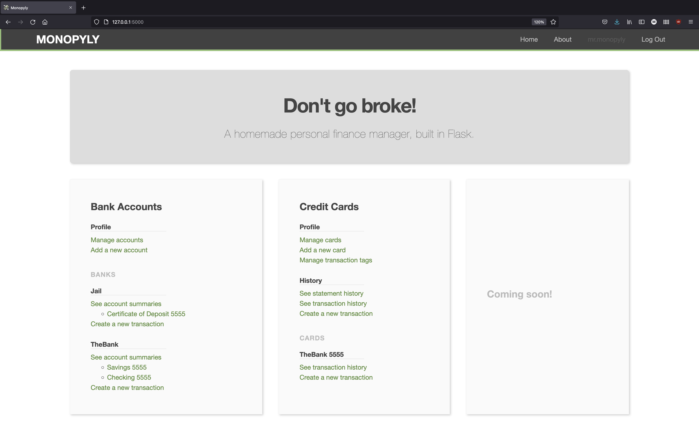
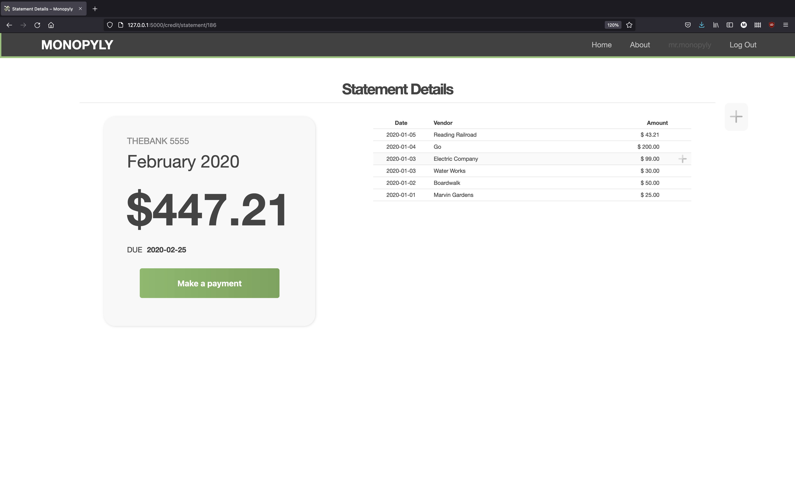

# Monopyly


This is a package designed to help manage personal finances. 
The current functionality is fairly limited, with only the ability to track credit card history.
Eventually the app will provide a full set of features including purchase history, bank deposits and withdrawals, and investment profiles. 

The app is designed to be run at a small scale. 
Information is stored in a local SQLite database and accessed using a frontend served by Flask. 
While the development version is hosted on the builtin Flask server, a more robust solution will be adopted if the app moves online.
Despite its small scale, the app can support multiple users on any given instance.


## Installation

The _Monopyly_ app is registered on the [Python Package Index (PyPI)](https://pypi.org/project/monopyly) for easy installation. 
To install the app, simply run

```
pip install monopyly
```

The package requires a recent version of Python (3.7+). 


## Getting started

Once the package is properly installed, run the app from the command line:

```
monopyly
```

This will open to an empty homepage with a welcome message.


To use the app, register a new profile and then log in using your newly created credentials.
A successful login will return you to the homepage, now with several different feature panels.



Your username should now appear at the top right of the screen, and the 'Log In' button will be replaced with a 'Log Out' button.


## Features


### Credit Card Transactions

_Monopyly_ provides an accounting system for a user's credit card transactions.
To use this feature, begin by navigating to the 'Manage accounts' page.
From there, the app will allow you to add credit cards and associate each with an account.
If an account does not already exist for the card you are trying to add, a card can be added to a new account.
This account will be associated with a specific bank, and will track all of cards for that account (card's are ID'd by the last four digits of the credit card number).
Additionally, each account must also be initialized with the date when the account issues statements and the date when those statements are due.

After creating a card, you will be redirected to a page displaying the account details, including all cards for that account.


After adding one or more cards, head on back to the homepage and click the 'Create a new transaction' link. 
You will move to a page where you can enter credit card transaction information.
After successfully entering the transaction information, the transaction will appear on the full transaction history page.


Card balances are also visible by visiting the pages for individual statements. A full history of statements for each card is available off the homepage. 
Each statement's page gives the statement's balance, transactions, and due date. 
Payments can be made directly from a statement's page.




## License

This project is licensed under the GNU General Public License, Version 3.
It is fully open-source, and while you are more than welcome to fork, add, modify, etc. it is required that you also keep those changes and additions open-source.


## Changes

Changes between versions are tracked in the [changelog](CHANGELOG.md).